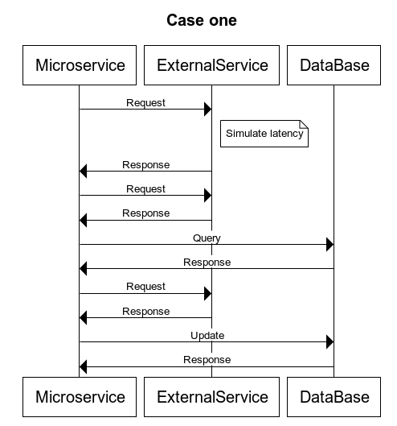
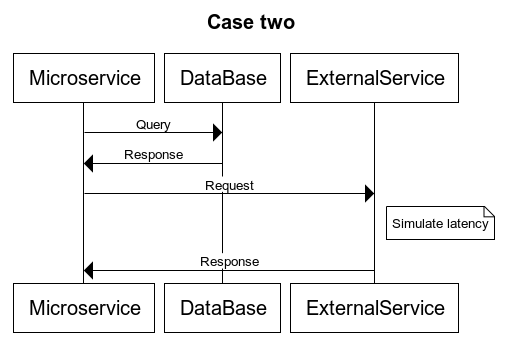
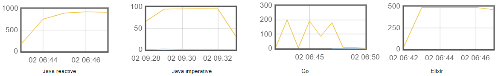

# Backend benchmark (Java - Elixir - Go)

### Prerequisites
To run this project you need:

- `aws-cli`
- `jq`


### Stacks 
- Java imperative - Spring boot `java-imperative-ms`
- Java Reactive - Spring webflux `java-reactive-ms`
- Elixir - Cowboy `elixir-ms`
- Go - Gin `go-ms`


Each stack generates a separate environment as follows


### Example use cases




## Usage

```shell
cd sh

# ./aws_start.sh <stack>
./aws_start.sh go-ms
```

```shell
./test_jmeter.sh go-ms
```

Results for case two with a latency of 100ms (t2.micro)


