# Benchmark (Java - Elixir)

Se realiza el siguiente benchmark con el fin de validar el performance de los siguientes alternativa:

- Spring boot (Undertow)
- Spring boot (Tomcat)
- Spring WebFlux (Netty)
- Elixir (Plug Cowboy)

---

###### Configuración:
- _Amazon EC2 c5.large_
- _PostgreSQL db.m6g.large_
- _Nodejs express para simular latencia, se usa cómo servicio externo en diferente máquina_

##### Nota:
- Para validar el número de request por segundo se hace uso de la herramienta wrk con la siguiente configuración _wrk -t8 -c500 -d30s_
- Para validar el comportamiento de la latencia se ocupa apache benchmark (ab) con dos tipos de configuración
  - Carga alta: _ab -n 9000 -c 1000_
  - Carga baja:  _ab -n 9000 -c 100_


## Servicio base
Iniciamos validando el performance de las diferentes alternativas con un servicio sencillo que solo retorna una cadena de string sencilla.

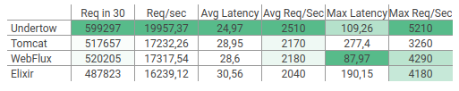
##### _Carga alta_

##### _Carga media_
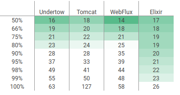

En este primer escenario todas las alternativas tiene un performance similar donde en número de request por segundo sobresale Undertow, por otro lado Elixir y Webflux ofrecen una mayor estabilidad en los resultados.

## Servicio I/O bound

#### Latencia de 10ms
Servicio que realiza un llamado http a un servicio externo con una latencia de 10 ms.

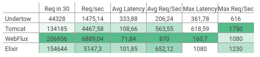
###### _Carga alta_
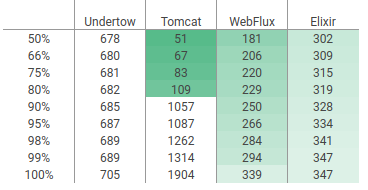
###### _Carga media_
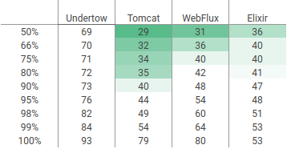

En este escenario donde empezamos a añadir latencia podemos ver cómo las opciones reactivas nos ofrecen un mejor rendimiento, con una latencia baja de 10 milisegundos las estrategias reactivas empiezan casi a duplicar en rendimiento a las bloqueantes.

#### Latencia de 100ms
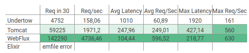
###### _Carga alta_
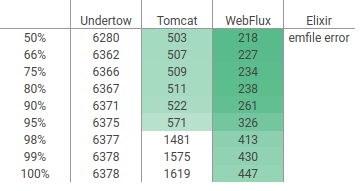
###### _Carga media_
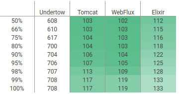

Cuando la latencia empieza a aumentar, en este caso 100ms, las estrategias reactivas triplican en rendimiento a las bloqueantes. En este punto es más claro como las alternativas bloqueantes se empiezan a quedar sin hilos útiles ya que pasan un mayor tiempo bloqueados a la espera generando desperdicio de recursos.

#### Latencia de 500ms
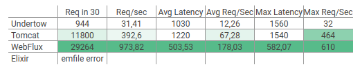
###### _Carga alta_
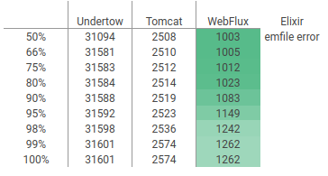
###### _Carga media_
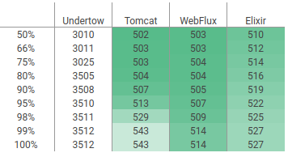

Podemos observar cómo a medida que la latencia aumenta, las estrategias bloqueantes ofrecen un menor rendimiento 

## Base de datos

#### Consulta sencilla
```sql
SELECT a.id, … FROM account AS a WHERE (a.id = 4000)
```
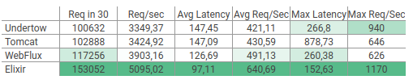
###### _Carga alta_
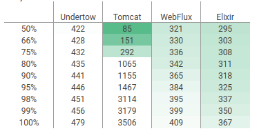
###### _Carga media_
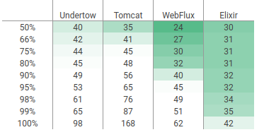

#### Consulta un poco más compleja
```sql
select * from account a where a.balance > (select avg(a.balance) + 72700000 from account a)
```
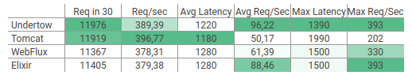
###### _Carga alta_
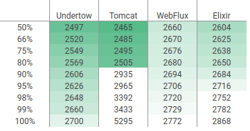
###### _Carga media_


#### Actualización
```sql
update
```
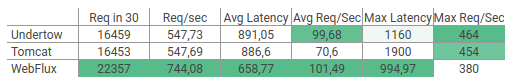
###### _Carga alta_
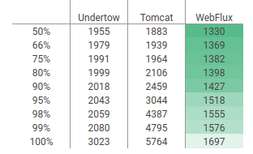
###### _Carga media_
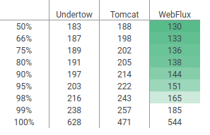

Hay un cuello de botella común que es la base de datos aunque con una diferencia, el enfoque imperativo no puede realizar más tareas ya que tiene todos los hilos bloqueados esperando, por otro lado en el enfoque reactivo se pueden realizar tareas diferentes que no estén relacionadas con el cuello de botella que se tiene.

## Servicio CPU bound
Servicio que calcula los primeros 1.000 número primos

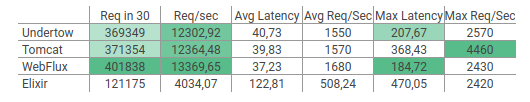
###### _Carga alta_
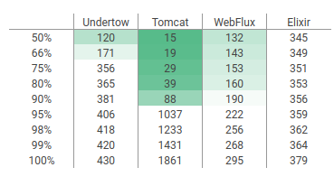

Ya que webflux nos permite usar fácilmente un pool de hilos especializado para un grupo de tareas en particular, podemos separar las tareas vinculadas a CPU en un thread pool con un número de hilos fijos igual al número de procesadores disponibles. Lo anterior nos genera un mejor performance al evitar al máximo context switching.

## Servicio CPU + I/O bound
Por último ponemos a prueba los servidos con una carga conjunta de procesos vinculados a CPU y a IO.

Este escenario de prueba es bastante importante ya que es más cercano a las cargas de trabajo que podemos encontrar en el día a día, adicional nos permite visualizar si se está haciendo un uso adecuado de todos los recursos.

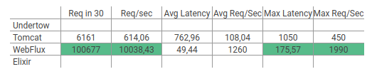

Se realiza una carga (_wrk -t8 -c500 -d30s_) de llamados intensivos en IO a un servicio externo con 500 ms de latencia con el fin de validar dada dicha carga cómo se comporta el uso de otros recursos, en este caso una carga de llamados vinculados a CPU donde se calculan los primeros 1000 números primos durante 10 segundos (wrk -t8 -c500 -d10s)

Undertow dados su bajo número de hilos y tomando en cuenta de que estos están bloqueados esperando respuesta del servicio http (500 ms de latencia) no alcanza a responder ninguna otra solicitud. Elixir dada la alta carga el servicio empieza a responder emfile (este error se podría resolver mediante configuración del micro pero la idea es validar con los valores configurados por defecto en cada una de las herramientas).

Nos queda tomcat y webflux, tomcat al ser una alternativa bloqueante vemos que su performance baja considerablemente ya que aunque por defecto su threadpool contiene 200 hilos, estos rápidamente se ven bloqueados y no alcanza a responder muchas peticiones. Hay un desperdicio de CPU ya que la máquina pasa gran parte del tiempo bloqueada esperando notificación del sistema operativo.
Finalmente tenemos webflux donde es evidente que hay un mejor uso de los recursos

### Conclusiones

En contextos con baja concurrencia y con latencias internas muy bajas podemos elegir sin problema alternativas bloqueantes como Tomcat y Undertow sin mayores inconvenientes. Por otro lado, si necesitamos soportar un mayor número de concurrencia la elección debería ser una alternativa reactiva como Webflux (netty).

Usar una alternativa reactiva nos permite separar con mayor facilidad diferentes tipos de cargas de trabajo cómo operaciones vinculadas a CPU en un thread pool especializado, tomando ventajas y obteniendo un mayor performance al evitar el context switching.

Usar alternativas reactivas nos permite hacer un uso más eficiente de todos los recursos.

Se puede complementar un poco mas la información con la siguiente [charla](https://youtu.be/Zy0ayHq4K_k).
