# Backend benchmark (Java - Elixir - Go)

### Prerequisites
To run this project you need:

- `aws-cli`
- `jq`

## Stacks 
- Java imperative - Spring boot `java-imperative-ms`
- Java Reactive - Spring webflux `java-reactive-ms`
- Elixir - Cowboy `elixir-ms`
- Go - Gin `go-ms`


Each stack generates a separate environment as follows


(c5.large)

### Health check


Most of the benchmarks only present this scenario, although it is an important scenario, it does not represent the closest cases to reality.

### Case one

The following scenario tries to simulate an example closer to reality in the following way


(Latency 50ms)

(Latency 200ms)
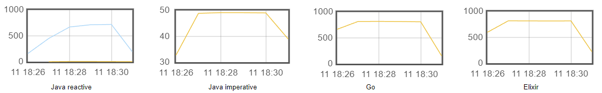

Although the latency increases almost 4 times more, the non-blocking alternatives continue to behave the same, unlike the blocking alternative, which is affected in the same proportion

### Case two


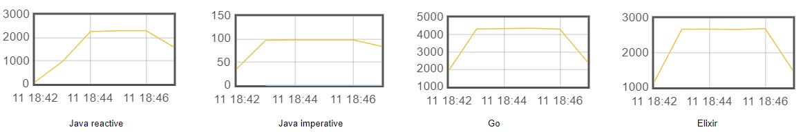

### Case one + Case two (Together)

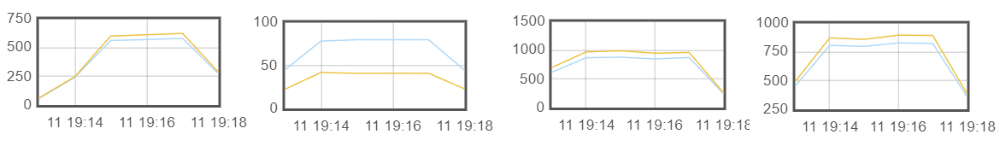

### Case three
(Database query only)


### Primes
Calculation of the first 1000 prime numbers

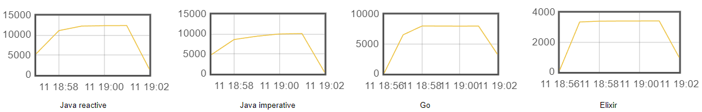

Since in webflux we can easily use a dedicated thread pool, we can separate CPU bound tasks into a thread pool with a fixed number of threads equal to the number of available processors. The above generates a better performance by avoiding context switching as much as possible.

### Only External service
(Latency 80ms)

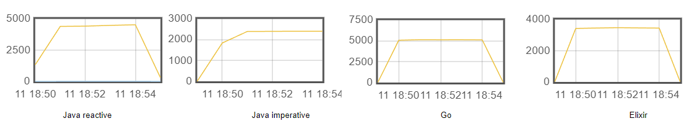

In contexts with low concurrency and very low internal latencies, we can easily choose blocking alternatives without major inconveniences. On the other hand, if we need to support a higher number of concurrency, the choice should be a non-blocking alternative.

Using non-blocking alternatives allows us to make more efficient use of all resources.

In conclusion, in non-blocking stacks we can see very similar behaviors.

In Java stacks, the performance when starting the test is not the most optimal due to the warming up of the jvm. With spring native it is expected to solve the previous problem.


### Cpu and memory (Results with t2.micro)


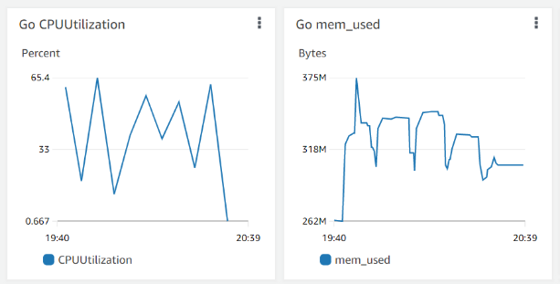


In go we can see a lower use of resources, both memory and cpu.


## Usage

```shell
cd sh

# ./aws_start.sh <stack>
./aws_start.sh go-ms
```

```shell
./test_jmeter.sh go-ms
```

### Results with t2.micro


#### Health check

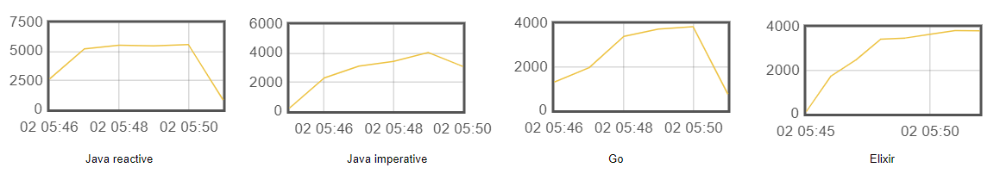

#### Case one

(Latency 50ms)

(Latency 200ms)
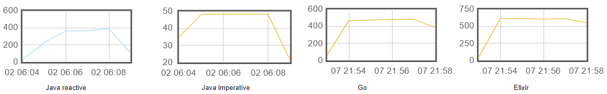

#### Case two

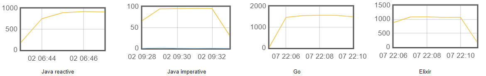

#### Case one + Case two (Together)


#### Case three


#### Primes

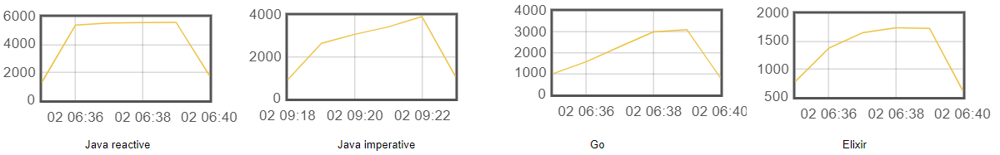

#### Only External service

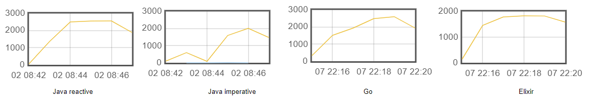
