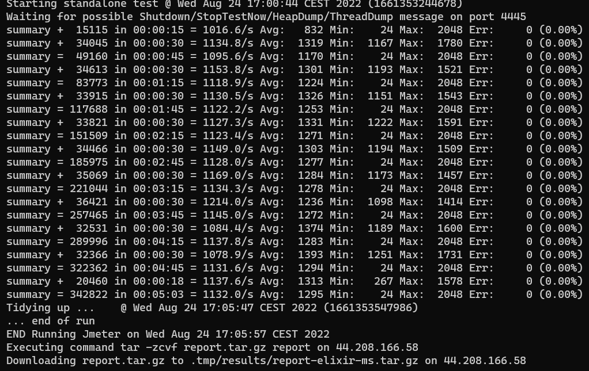

# Cómo ejecutar el benchmark

### Requisitos previos
- `jq`
- `aws-cli`

### Configuración

El benchmark está configurado para ejecutarse de forma automatizada dentro de la infraestructura de aws por lo que necesitaremos una [cuenta](https://aws.amazon.com/es/what-is-aws/) de dicha plataforma.

En la ruta `sh/config.json` encontrará la respectiva información de la configuración la cual puede cambiar para ajustar el benchmark. 

Estos son los datos que encontrará en el archivo de configuración:

```json
{
    "url_reposity": "https://github.com/maocq/backend-benchmark",
    "user": "ubuntu",
    "key": "/c/Users/john.carmona/Documents/maow/maocq-keypair.pem",
    "key_name": "maocq-keypair",
    "instance_type": "t2.micro",
    "security_group": "sg-06a750fe52622641f",
    "image_id": "ami-052efd3df9dad4825"    
}
```

La información necesaria que debe actualizar es la ubicación de su [llave](https://aws.amazon.com/es/what-is-aws/) (inicio de sesión), nombre de la llave en aws y el security group. 

Dentro de la configuración del security group es necesario con el fin de facilitar las pruebas tener las siguientes reglas configuradas:


(Esta configuración corresponde a escenarios de pruebas, no usar esta configuración en ambientes productivos)

Puede cambiar la [instancia](https://aws.amazon.com/es/ec2/instance-types/) de ec2 usada en el benchmark así como la [imagen](https://docs.aws.amazon.com/AWSEC2/latest/UserGuide/finding-an-ami.html) de la máquina de Amazon con el fin de validar sus propios escenarios.

### Inicio

En la carpeta `sh` encontrará los archivos necesarios para levantar los ambientes y realizar las pruebas.

El benchmark cuenta con los siguientes stacks:

- Java imperative | java-imperative-ms
- Java Reactive | java-reactive-ms
- Elixir | elixir-ms
- Go | go-ms

Para iniciar cada uno de los stack nos apoyamos en el archivo aws_start.sh el cual recibe como parametro el stack a ejecutar (De forma separada para facilitar la verificación rápida de stacks y escenarios puntuales)

`./aws_start.sh java-reactive-ms`

La ejecución anterior generará el siguiente ambiente:


`...`


Al final podrá ver la ip asignada al microservicio y la cual puede abrir en un navegador


### Inicio del benchmark

Se cuentan con diferentes herramientas para realizar las mediciones:

- [Apache jmeter](https://jmeter.apache.org/)
- [Apache benchmark](https://httpd.apache.org/docs/2.4/programs/ab.html)
- [wrk](https://github.com/wg/wrk)
- [Performance analyzer](https://github.com/bancolombia/distributed-performance-analyzer)

En este [artículo](https://medium.com/) veremos los resultados arrojados por JMeter ya que es una herramienta común que nos permite ejecutar múltiples escenarios al tiempo y con facilidad de visualización. Además teniendo en cuenta que el comportamiento de los resultados es similares entre las diferentes herramientas.

### Cómo lanzar escenarios

En la carpeta jmeter encontrará su respectiva configuración, para ajustar los escenarios a ejecutar solo debe actualizar los valores necesarios.

```json
{
    "duration_seconds" : 300,
    "ramp_up_period_seconds": 10,
    "latency": 0,
    "hello_number_users": 0,
    "case_one_number_users": 1500,
    "case_two_number_users": 0,
    "case_three_number_users": 0,
    "get_hello_number_users": 0,
    "primes_number_users": 0,
    "find_one_number_users": 0,
    "find_multiple_test_number_users": 0
}
```

La latencia está dada en milisegundos y puede modificar la cantidad de usuarios concurrentes que quiera ejecutar en cada uno de los escenarios. Si el valor es cero dicho escenario no será ejecutado.

Una vez tenga la configuración deseada solo debe ejecutar el archivo `sh/test_jmeter.sh` pasando como parámetro el stack que se desea probar.

`./test_jmeter.sh java-reactive-ms`



Los resultados son generados en la ruta `sh\.tmp\results`

Nota: Cada vez que se ejecuta una prueba, la instancia es reiniciada con el fin de simular cada caso lo más cercano a los escenarios reales de escalamiento.

### Limpieza

Una vez terminadas las pruebas puede ejecutar el archivo clean.sh el cual se encarga de limpiar todo y terminar las instancias usadas.


