# Backend benchmark (Java - Elixir - Go)

## (t2.micro)

### Health check
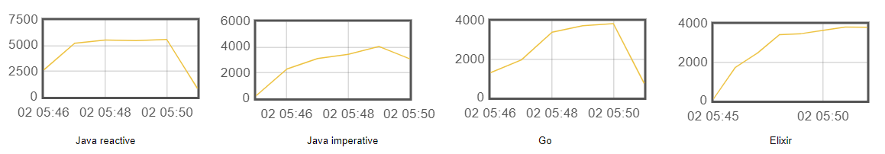

### Case one
(Latency 50ms)
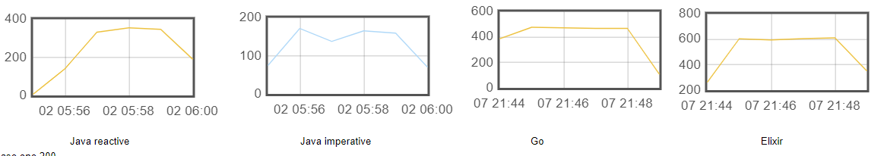
(Latency 200ms)
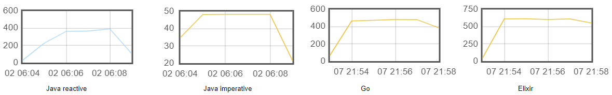

### Case two
(Latency 100ms)
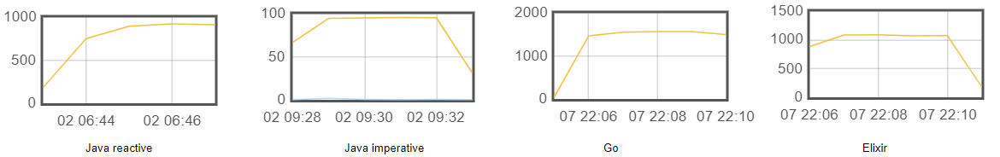

### Case one + Case two (Together)
(Latency 80ms)
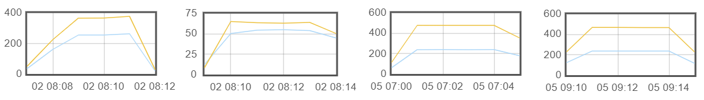

### Case three
(Database query only)

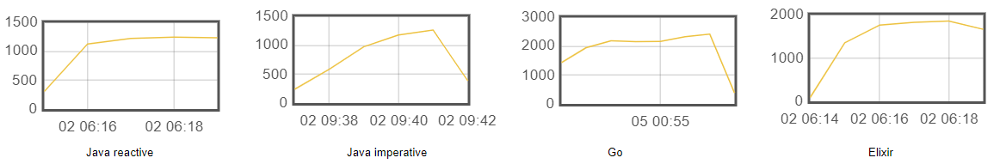

### Primes
Calculation of the first 1000 prime numbers

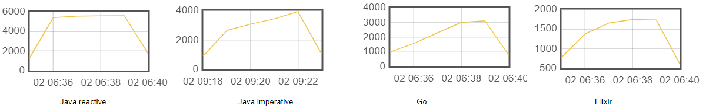

### Only External service
(Latency 80ms)

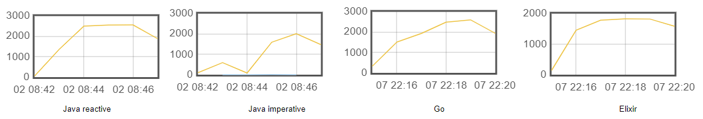

### Cpu and memory (Results with t2.micro)

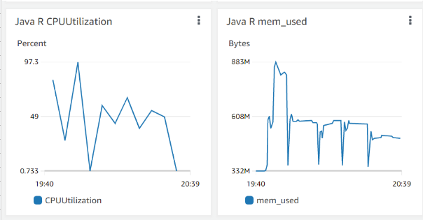
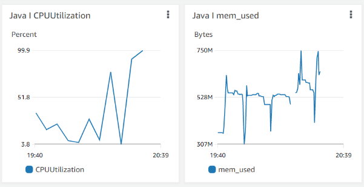
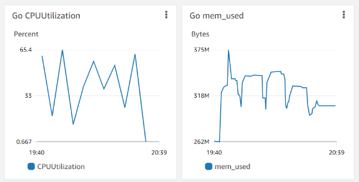
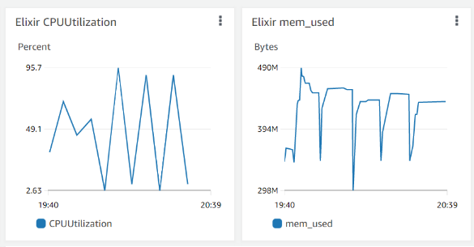

## (c5.large)

### Health check
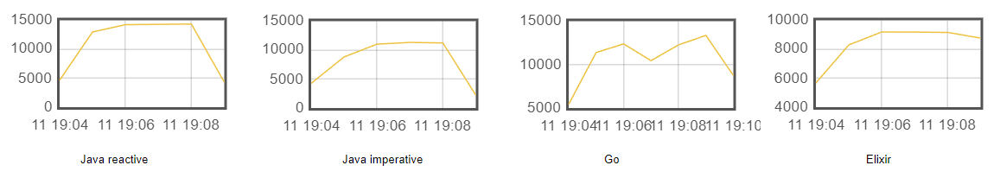

### Case one
(Latency 50ms)
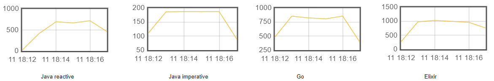
(Latency 200ms)
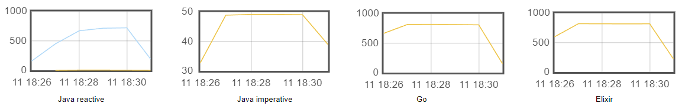

### Case two
(Latency 100ms)
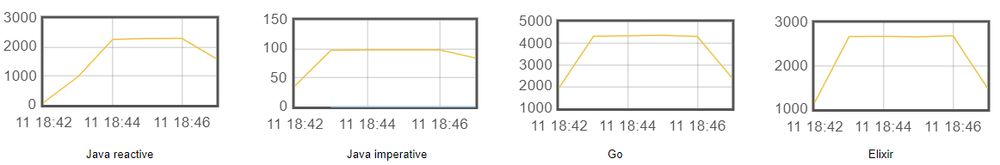

### Case one + Case two (Together)
(Latency 80ms)
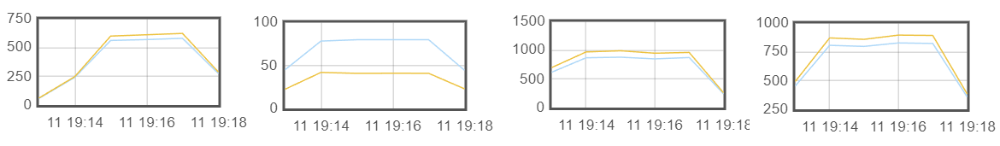

### Case three
(Database query only)

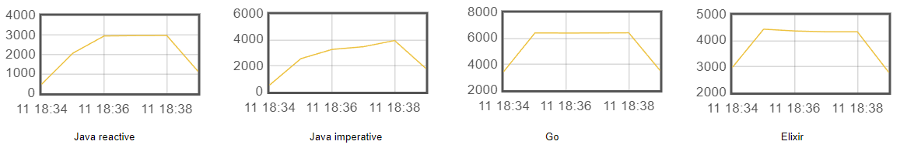

### Primes
Calculation of the first 1000 prime numbers

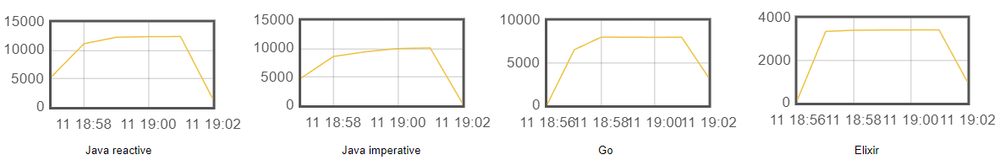

### Only External service
(Latency 80ms)

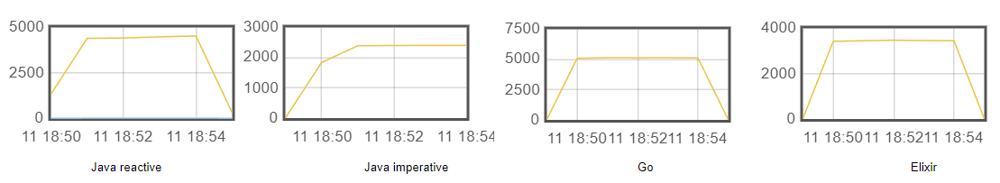
